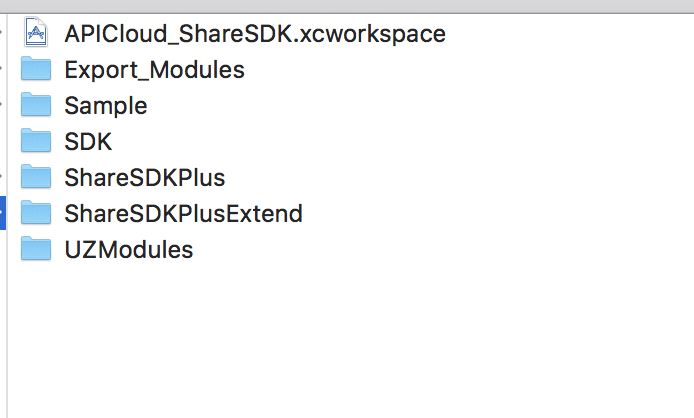
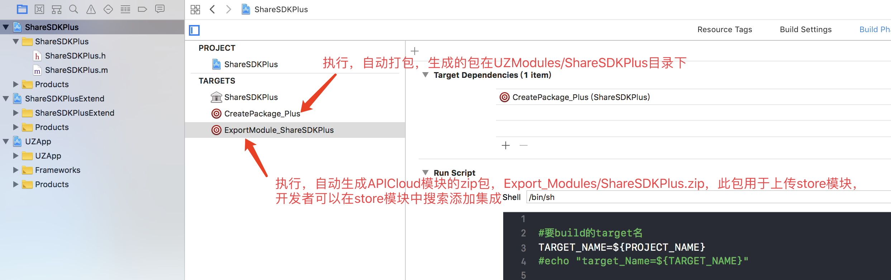
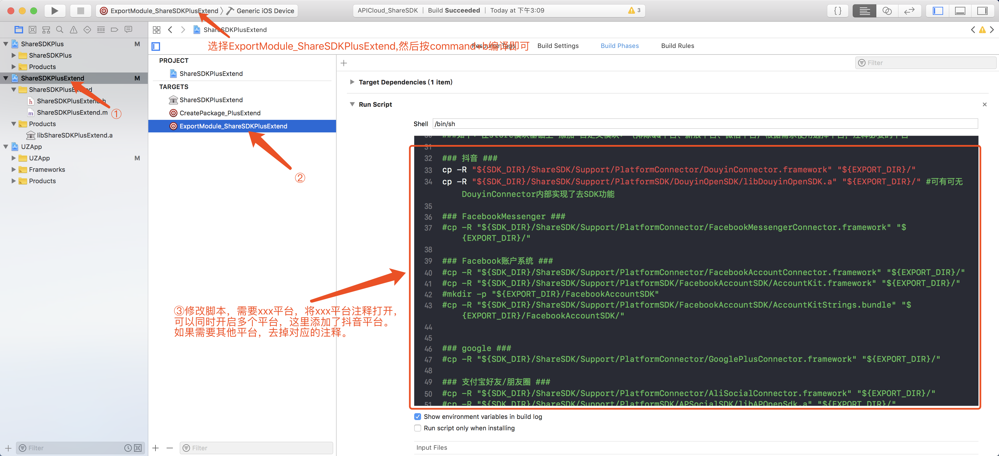
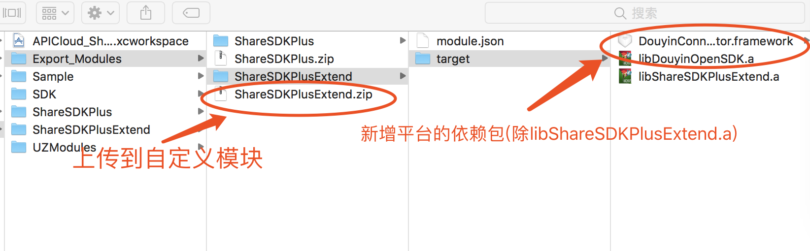

## ios平台-ShareSDKPlus项目说明

  

**Sample**:测试使用xcode编译效果demo  

**SDK**:原生Xcode项目集成ShareSDK所需的架构包  

**ShareSDKPlus**:生成模块包(桥接包)工程，也是制作模块包所必需的.a包

**ShareSDKPlusExtend**:生成模块包(桥接包)工程,此工程主要扩展平台使用. 

**UZModules**:由ShareSDKPlus和ShareSDKPlusExtend工程最终打包生成的Release包(libShareSDKPlus.a、libShareSDKPlusExtend.a)

**Export_Modules**:最终APICloud平台上传zip文件，制作模块用于store模块或是自定义模块使用，是由UZModules目录和SDK目录根据需求结合生成store模块/自定义模块。  

**Export_Modules/ShareSDKPlus**:制作store模块，此模块包含ShareSDK的基础架构包及三个平台(微信、QQ、新浪微博)架构包及第三方SDK  

**Export_Modules/ShareSDKPlusExtend**:制作自定义模块，此模块根据开发者需要自行添加其他平台(除微信、QQ、新浪微博外)，进行打包上传到自定义模块，比如开发者需要facebook平台，那么在store模块里添加ShareSDKPlus模块外 还需自己制作一个自定义模块ShareSDKPlusExtend内部含有facebook相关包，具体如果制作下方文档介绍。

### 制作store模块

选择`ExportModule_ShareSDKPlus`的target进行编译，在Export_Modules目录下生成ShareSDKPlus.zip包，此包主要由mob官方上传到apicloud平台的store模块里进行审核，提供给开发者，开发者在apicloud平台上创建应用，在模块库里直接搜索添加ShareSDKPlus模块。

### 自定义添加平台-自定义模块

由于ShareSDK集成的第三方平台比较多，ShareSDKPlus模块只集成了三个平台(微信、QQ、新浪微博)，如何加入对其他平台授权或分享的支持呢？这里就需要开发者自己通过我们开源的项目生成自定义模块ShareSDKPlusExtend.zip，上传到apicloud平台的应用内自定义模块上，对ShareSDKPlus模块进行补充，自定义的ShareSDKPlusExtend模块，依赖模块库里的ShareSDKPlus模块。

如何添加其他平台如下步骤：

编译后生成zip

